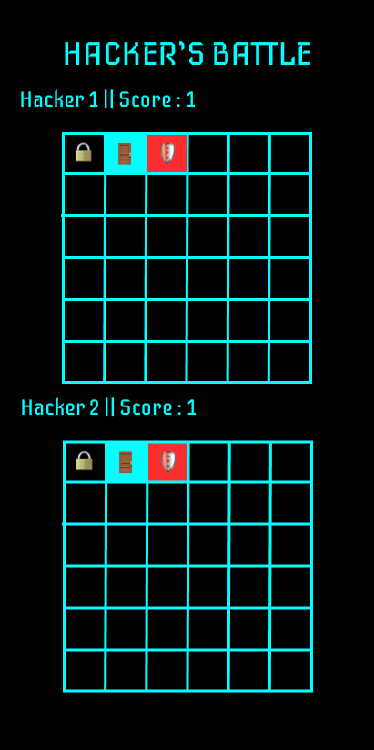
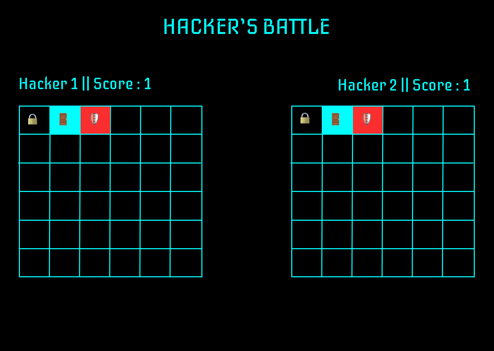
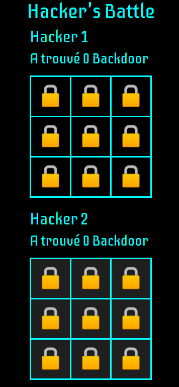
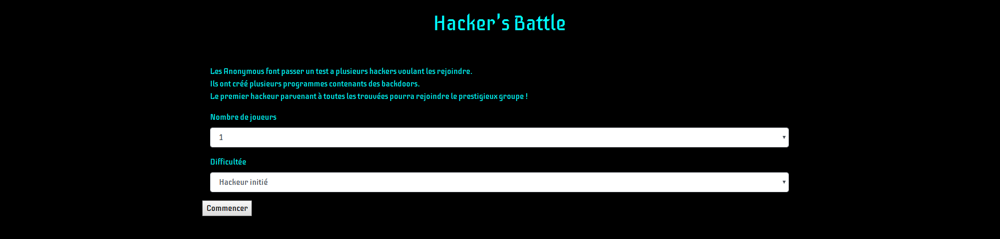
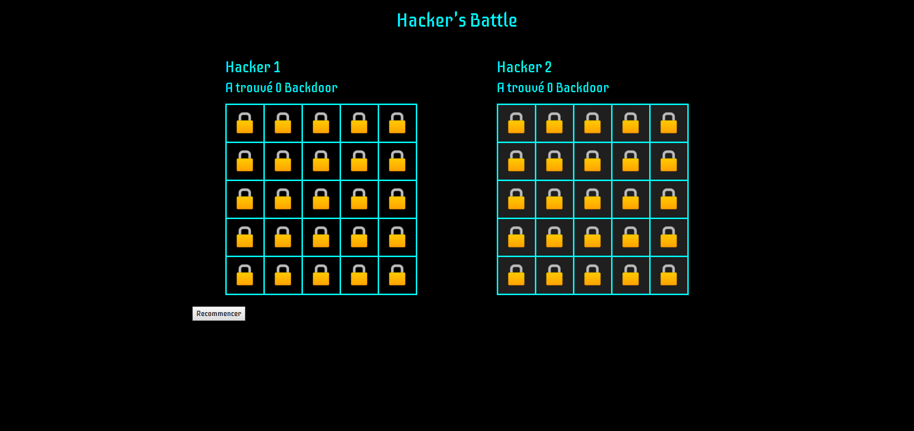

# Hacker's Battle

## Description

Ceci est un projet **réalisé en quatre jours** en solo. Ce dernier est un jeu basé sur le célèbre Touché Coulé. Ici, nous pouvons jouer à 1, 2 ou 4 joueurs dans trois niveaux de difficulté.   
Le thème du jeu est basé sur le hacking. En effet, des hackeurs sont en compétition afin de rejoindre les Anonymous. Pour cela ils doivent essayer de trouver des backdoors laissées dans des programmes tout en évitant les protections.  
Pour ce projet, je me suis lancé le **défi de travailler avec AngularJS alors que je n'avais jamais utilisé cette technologie.**  

## Technologies utilisées

* AngularJS
* HTML
* CSS
* Bootstrap

## Mockups Low Fidelity

### Version mobile

### Version desktop

## Version finale

### Version mobile

### Version desktop

  

